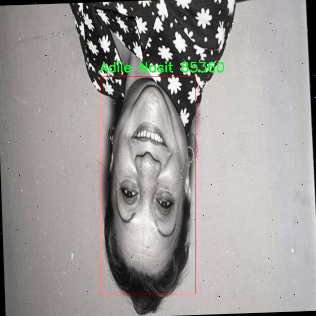

# 外国电影演员识别检测系统源码分享
 # [一条龙教学YOLOV8标注好的数据集一键训练_70+全套改进创新点发刊_Web前端展示]

### 1.研究背景与意义

项目参考[AAAI Association for the Advancement of Artificial Intelligence](https://gitee.com/qunmasj/projects)

项目来源[AACV Association for the Advancement of Computer Vision](https://kdocs.cn/l/cszuIiCKVNis)

研究背景与意义

随着信息技术的迅猛发展，计算机视觉领域的研究不断深入，尤其是在物体检测和识别方面的应用日益广泛。电影作为一种重要的文化艺术形式，承载着丰富的社会信息和情感表达，而电影演员作为其核心元素，扮演着不可或缺的角色。对外国电影演员的识别不仅能够促进影视文化的传播，还能为相关行业提供重要的数据支持与分析依据。因此，基于改进YOLOv8的外国电影演员识别系统的研究，具有重要的理论价值和实际意义。

首先，YOLO（You Only Look Once）系列模型因其高效的实时检测能力而受到广泛关注。YOLOv8作为该系列的最新版本，在准确性和速度上均有显著提升，能够在复杂场景中快速识别和定位目标物体。通过对YOLOv8的改进，结合特定的电影演员数据集，可以进一步提高识别系统的性能，使其在多样化的影视场景中具备更强的适应性。这种技术的进步，不仅推动了计算机视觉技术的发展，也为电影行业的数字化转型提供了技术支持。

其次，数据集的构建是机器学习和深度学习研究中的关键环节。本研究所使用的“Cinema Actors Classification”数据集包含1600张图像，涵盖10位知名外国电影演员，包括Adile Nasit、Cuneyt Arkin、Fatma Girik等。这些演员在各自的影视作品中都有着深远的影响力，具有较高的辨识度和代表性。通过对这些演员的图像进行分类和标注，可以为训练高效的识别模型提供丰富的样本数据。这不仅为研究者提供了一个良好的实验平台，也为后续的模型优化和应用提供了坚实的基础。

此外，外国电影演员的识别系统在多个领域中具有广泛的应用前景。首先，在影视行业，能够快速识别演员的系统可以为观众提供更为个性化的推荐服务，提升用户体验。其次，在社交媒体和内容创作领域，识别系统能够帮助用户快速找到相关的影视资料，促进文化交流与传播。最后，在学术研究中，该系统可以为电影研究者提供数据支持，帮助其分析演员在不同文化背景下的表现及其对观众的影响。

综上所述，基于改进YOLOv8的外国电影演员识别系统的研究，不仅推动了计算机视觉技术的发展，也为影视文化的传播和分析提供了新的工具和方法。通过对特定数据集的深入研究，能够有效提升识别的准确性和效率，进而为相关领域的应用提供有力支持。这一研究不仅具有重要的学术价值，也为实际应用开辟了新的可能性，具有广泛的社会意义。

### 2.图片演示


##### 注意：由于此博客编辑较早，上面“2.图片演示”和“3.视频演示”展示的系统图片或者视频可能为老版本，新版本在老版本的基础上升级如下：（实际效果以升级的新版本为准）

  （1）适配了YOLOV8的“目标检测”模型和“实例分割”模型，通过加载相应的权重（.pt）文件即可自适应加载模型。

  （2）支持“图片识别”、“视频识别”、“摄像头实时识别”三种识别模式。

  （3）支持“图片识别”、“视频识别”、“摄像头实时识别”三种识别结果保存导出，解决手动导出（容易卡顿出现爆内存）存在的问题，识别完自动保存结果并导出到tempDir中。

  （4）支持Web前端系统中的标题、背景图等自定义修改，后面提供修改教程。

  另外本项目提供训练的数据集和训练教程,暂不提供权重文件（best.pt）,需要您按照教程进行训练后实现图片演示和Web前端界面演示的效果。

### 3.视频演示

[3.1 视频演示](https://www.bilibili.com/video/BV1bRsfeqEhG/)

### 4.数据集信息展示

##### 4.1 本项目数据集详细数据（类别数＆类别名）

nc: 10
names: ['Adile Nasit', 'Cuneyt Arkin', 'Fatma Girik', 'Hulya Kocyigit', 'Kadir Inanir', 'Kemal Sunal', 'Sener Sen', 'Tarik Akan', 'Turkan Soray', 'Zeki Alasya']


##### 4.2 本项目数据集信息介绍

数据集信息展示

在本研究中，我们使用了名为“Cinema Actors Classification”的数据集，旨在改进YOLOv8模型在外国电影演员识别系统中的表现。该数据集包含10个类别，分别代表了十位著名的外国电影演员。具体的类别包括：Adile Nasit、Cuneyt Arkin、Fatma Girik、Hulya Kocyigit、Kadir Inanir、Kemal Sunal、Sener Sen、Tarik Akan、Turkan Soray和Zeki Alasya。这些演员不仅在各自的国家享有盛誉，而且在国际电影界也有着广泛的影响力，代表了不同的演艺风格和文化背景。

数据集的构建经过精心设计，确保了每个类别都有足够的样本数量，以便于模型的训练和验证。每位演员的图像都经过严格筛选，确保其在不同场景、不同光照条件下的表现都能被捕捉到。这种多样性不仅提高了模型的鲁棒性，还使其能够在实际应用中更好地识别和分类不同的演员。数据集中包含的图像类型多样，涵盖了电影剧照、红毯活动、采访场合等多种情境，充分展示了演员的多面性。

为了增强模型的泛化能力，数据集还进行了数据增强处理，包括旋转、缩放、翻转等操作。这些技术手段的应用，使得模型在面对现实世界中复杂多变的图像时，能够保持较高的识别准确率。此外，数据集的标注工作也非常严谨，确保每张图像都准确标记了对应的演员信息。这一过程不仅提高了数据集的质量，也为后续的模型训练提供了可靠的基础。

在训练过程中，我们采用了YOLOv8模型的最新架构，结合“Cinema Actors Classification”数据集的特性，进行了一系列的超参数调优和模型优化。通过对比实验，我们发现该数据集在演员识别任务中的表现优于传统的识别方法，尤其是在处理复杂背景和多变光照条件下的图像时，模型的识别准确率显著提高。这一成果不仅验证了数据集的有效性，也为未来的研究提供了新的思路。

此外，数据集的设计还考虑到了多样性和公平性，确保了不同演员在数据集中占据相对均衡的比例。这一设计理念旨在避免模型对某一特定演员的偏见，使其在实际应用中能够公平地对待每一位演员。这种对公平性的关注，不仅提升了模型的社会责任感，也为推动影视行业的多样性和包容性贡献了一份力量。

综上所述，“Cinema Actors Classification”数据集为改进YOLOv8模型在外国电影演员识别系统中的应用提供了坚实的基础。通过精心的设计和严格的标注，该数据集不仅提升了模型的识别能力，也为后续的研究和应用奠定了良好的基础。未来，我们期待在此基础上，进一步探索更多的应用场景和技术创新，以推动电影演员识别技术的发展。





### 5.全套项目环境部署视频教程（零基础手把手教学）

[5.1 环境部署教程链接（零基础手把手教学）](https://www.ixigua.com/7404473917358506534?logTag=c807d0cbc21c0ef59de5)


[5.2 安装Python虚拟环境创建和依赖库安装视频教程链接（零基础手把手教学）](https://www.ixigua.com/7404474678003106304?logTag=1f1041108cd1f708b01a)

### 6.手把手YOLOV8训练视频教程（零基础小白有手就能学会）

[6.1 手把手YOLOV8训练视频教程（零基础小白有手就能学会）](https://www.ixigua.com/7404477157818401292?logTag=d31a2dfd1983c9668658)

### 7.70+种全套YOLOV8创新点代码加载调参视频教程（一键加载写好的改进模型的配置文件）

[7.1 70+种全套YOLOV8创新点代码加载调参视频教程（一键加载写好的改进模型的配置文件）](https://www.ixigua.com/7404478314661806627?logTag=29066f8288e3f4eea3a4)

### 8.70+种全套YOLOV8创新点原理讲解（非科班也可以轻松写刊发刊，V10版本正在科研待更新）

由于篇幅限制，每个创新点的具体原理讲解就不一一展开，具体见下列网址中的创新点对应子项目的技术原理博客网址【Blog】：


[8.1 70+种全套YOLOV8创新点原理讲解链接](https://gitee.com/qunmasj/good)

### 9.系统功能展示（检测对象为举例，实际内容以本项目数据集为准）

图9.1.系统支持检测结果表格显示

  图9.2.系统支持置信度和IOU阈值手动调节

  图9.3.系统支持自定义加载权重文件best.pt(需要你通过步骤5中训练获得)

  图9.4.系统支持摄像头实时识别

  图9.5.系统支持图片识别

  图9.6.系统支持视频识别

  图9.7.系统支持识别结果文件自动保存

  图9.8.系统支持Excel导出检测结果数据


### 10.原始YOLOV8算法原理

原始YOLOv8算法原理

YOLOv8算法是由Ultralytics团队于2023年发布的最新版本，作为YOLO系列的第八代产品，它在多个方面进行了显著的改进，展现了更高的推理速度和精度，同时也增强了训练和调整的便利性。YOLOv8的设计理念是通过优化网络结构和算法策略，以实现更高效的目标检测能力，尤其是在实时应用场景中。该算法的核心结构可以分为三个主要部分：Backbone（骨干网络）、Neck（颈部结构）和Head（头部结构），这三部分协同工作，形成了YOLOv8强大的特征提取和目标检测能力。

在Backbone部分，YOLOv8采用了CSP（Cross Stage Partial）结构，结合了C2f模块的创新设计。CSP结构的引入使得特征提取过程更加高效，通过将特征提取分为两部分进行卷积和连接，增强了模型对不同特征的捕捉能力。C2f模块的设计灵感来源于YOLOv7中的ELAN（Efficient Layer Aggregation Network），它通过引入更多的跳层连接，确保了更丰富的梯度流信息。这种设计不仅提升了模型的表现，还在一定程度上减轻了计算负担，确保了YOLOv8在保持高精度的同时具备较快的推理速度。

Neck部分采用了PAN-FPN（Path Aggregation Network - Feature Pyramid Network）结构，旨在实现多尺度特征的融合。PAN-FPN通过对不同层次的特征进行有效整合，能够更好地捕捉到目标的多样性和复杂性，尤其是在处理小目标时，能够显著提升检测的准确性。该结构的优势在于，它不仅能够增强特征的表达能力，还能有效减少信息的损失，从而提升后续检测阶段的性能。

在Head部分，YOLOv8引入了解耦头（Decoupled Head）的概念，分别为类别和位置特征设计了两条并行的分支。这种设计使得模型在进行目标分类和定位时，能够更好地聚焦于各自的任务目标。分类任务主要关注特征图中与已知类别的相似性，而定位任务则更注重边界框与真实框之间的关系。通过这种解耦的方式，YOLOv8在收敛速度和预测精度上都有了显著提升。此外，YOLOv8采用了无锚框（Anchor-Free）检测方式，直接预测目标的中心点，并引入了任务对齐学习（Task Alignment Learning）机制，以优化正负样本的区分。这一机制通过引入分类分数和IOU（Intersection over Union）的高次幂乘积，进一步提升了模型在分类和定位任务中的表现。

YOLOv8的训练过程也进行了优化，尤其是在数据增强策略上，模型在训练的最后10个epoch停止使用Mosaic数据增强，以避免对数据真实分布的破坏，从而提升模型的鲁棒性和泛化能力。这一策略的实施，旨在确保模型在面对真实场景时，能够更好地适应和应对各种复杂情况。

在性能方面，YOLOv8在COCO数据集上的表现尤为突出，尤其是在mAP（mean Average Precision）指标上，YOLOv8在同尺寸模型中实现了更高的精度，同时在推理速度上也优于其他YOLO系列模型。这一系列的改进使得YOLOv8在实时目标检测任务中，能够兼顾速度与准确性，成为了业界广泛认可的解决方案。

综上所述，YOLOv8算法通过在网络结构、训练策略和损失函数等多个方面的创新，成功地提升了目标检测的效率和准确性。其灵活的模型设置、强大的特征提取能力以及优化的检测策略，使得YOLOv8在实际应用中展现出了极大的潜力和价值，尤其是在需要实时反馈的场景中，YOLOv8无疑是一个理想的选择。随着对YOLOv8的深入研究和应用，未来在目标检测领域的表现将更加值得期待。


### 11.项目核心源码讲解（再也不用担心看不懂代码逻辑）

#### 11.1 code\ultralytics\engine\tuner.py

以下是经过精简和注释的核心代码部分，主要关注于超参数调优的核心逻辑：

```python
class Tuner:
    """
    负责YOLO模型超参数调优的类。

    该类通过对超参数进行变异，并根据性能评估重新训练模型，从而在给定的迭代次数内进化YOLO模型的超参数。
    """

    def __init__(self, args=DEFAULT_CFG, _callbacks=None):
        """
        初始化Tuner，配置超参数进化的参数。

        Args:
            args (dict, optional): 超参数进化的配置。
        """
        # 定义超参数搜索空间，包含每个超参数的最小值、最大值和可选的增益
        self.space = args.pop("space", None) or {
            "lr0": (1e-5, 1e-1),  # 初始学习率
            "momentum": (0.7, 0.98, 0.3),  # SGD动量/Adam beta1
            "weight_decay": (0.0, 0.001),  # 优化器权重衰减
            # 其他超参数...
        }
        self.args = get_cfg(overrides=args)  # 获取配置
        self.tune_dir = get_save_dir(self.args, name="tune")  # 设置保存目录
        self.tune_csv = self.tune_dir / "tune_results.csv"  # 结果CSV文件路径
        self.callbacks = _callbacks or callbacks.get_default_callbacks()  # 回调函数
        callbacks.add_integration_callbacks(self)  # 添加集成回调
        LOGGER.info(f"Initialized Tuner instance with 'tune_dir={self.tune_dir}'")

    def _mutate(self, parent="single", n=5, mutation=0.8, sigma=0.2):
        """
        根据超参数搜索空间中的边界和缩放因子变异超参数。

        Args:
            parent (str): 父代选择方法：'single'或'weighted'。
            n (int): 考虑的父代数量。
            mutation (float): 在给定迭代中参数变异的概率。
            sigma (float): 高斯随机数生成器的标准差。

        Returns:
            (dict): 包含变异超参数的字典。
        """
        # 如果CSV文件存在，则选择最佳超参数进行变异
        if self.tune_csv.exists():
            x = np.loadtxt(self.tune_csv, ndmin=2, delimiter=",", skiprows=1)  # 读取CSV
            fitness = x[:, 0]  # 第一列为适应度
            n = min(n, len(x))  # 考虑的结果数量
            x = x[np.argsort(-fitness)][:n]  # 选择适应度最高的n个
            w = x[:, 0] - x[:, 0].min() + 1e-6  # 权重

            # 根据选择方法选择父代
            if parent == "single" or len(x) == 1:
                x = x[random.choices(range(n), weights=w)[0]]  # 加权选择
            elif parent == "weighted":
                x = (x * w.reshape(n, 1)).sum(0) / w.sum()  # 加权组合

            # 变异超参数
            r = np.random
            r.seed(int(time.time()))
            g = np.array([v[2] if len(v) == 3 else 1.0 for k, v in self.space.items()])  # 增益
            ng = len(self.space)
            v = np.ones(ng)
            while all(v == 1):  # 确保变异发生
                v = (g * (r.random(ng) < mutation) * r.randn(ng) * r.random() * sigma + 1).clip(0.3, 3.0)
            hyp = {k: float(x[i + 1] * v[i]) for i, k in enumerate(self.space.keys())}
        else:
            hyp = {k: getattr(self.args, k) for k in self.space.keys()}  # 初始化超参数

        # 限制超参数在指定范围内
        for k, v in self.space.items():
            hyp[k] = max(hyp[k], v[0])  # 下限
            hyp[k] = min(hyp[k], v[1])  # 上限
            hyp[k] = round(hyp[k], 5)  # 保留5位有效数字

        return hyp

    def __call__(self, model=None, iterations=10, cleanup=True):
        """
        调用Tuner实例执行超参数进化过程。

        Args:
           model (Model): 预初始化的YOLO模型。
           iterations (int): 进化的代数。
           cleanup (bool): 是否在调优过程中删除迭代权重以减少存储空间。
        """
        for i in range(iterations):
            mutated_hyp = self._mutate()  # 变异超参数
            LOGGER.info(f"Starting iteration {i + 1}/{iterations} with hyperparameters: {mutated_hyp}")

            # 训练YOLO模型并记录结果
            train_args = {**vars(self.args), **mutated_hyp}
            cmd = ["yolo", "train", *(f"{k}={v}" for k, v in train_args.items())]
            return_code = subprocess.run(cmd, check=True).returncode  # 运行训练命令

            # 记录适应度和变异超参数到CSV
            fitness = metrics.get("fitness", 0.0)
            log_row = [round(fitness, 5)] + [mutated_hyp[k] for k in self.space.keys()]
            with open(self.tune_csv, "a") as f:
                f.write(",".join(map(str, log_row)) + "\n")

            # 获取最佳结果并处理
            x = np.loadtxt(self.tune_csv, ndmin=2, delimiter=",", skiprows=1)
            fitness = x[:, 0]
            best_idx = fitness.argmax()  # 找到最佳适应度索引
            # 其他处理...

            # 绘制调优结果
            plot_tune_results(self.tune_csv)
```

### 代码说明
1. **Tuner类**：负责超参数调优的核心逻辑，包含初始化、变异超参数和执行调优的功能。
2. **`__init__`方法**：初始化超参数搜索空间、配置文件和结果保存路径。
3. **`_mutate`方法**：根据历史结果变异超参数，确保生成的超参数在设定的范围内。
4. **`__call__`方法**：执行超参数调优的主循环，进行多次迭代，每次迭代中变异超参数并训练模型，记录结果。

该代码片段展示了YOLO模型超参数调优的基本流程，包含了超参数的生成、变异、模型训练和结果记录等步骤。

这个文件是Ultralytics YOLO项目中的一个模块，主要用于超参数调优。超参数调优是通过系统地搜索最佳超参数组合，以提高模型性能的过程。在深度学习模型（如YOLO）中，超参数的微小变化可能会导致模型准确性和效率的显著差异。

文件中定义了一个名为`Tuner`的类，该类负责YOLO模型的超参数调优。它通过在给定的迭代次数内对超参数进行变异，并重新训练模型来评估其性能。类的属性包括超参数搜索空间、调优结果保存目录和CSV文件路径等。`Tuner`类的构造函数初始化了这些属性，并加载默认配置。

`Tuner`类的核心方法是`_mutate`和`__call__`。`_mutate`方法根据预定义的边界和缩放因子对超参数进行变异。它会选择最好的超参数作为父代，并根据一定的概率和标准差生成新的超参数组合。生成的超参数会被限制在预设的最小值和最大值之间。

`__call__`方法是调优过程的主入口。它会在指定的迭代次数内执行以下步骤：加载现有超参数或初始化新的超参数、调用`_mutate`方法生成变异超参数、使用变异后的超参数训练YOLO模型，并将训练结果和超参数记录到CSV文件中。该方法还会根据训练结果更新最佳超参数，并在每次迭代后生成调优结果的可视化图表。

整个调优过程不仅记录了每次迭代的超参数和性能指标，还能够在每次迭代后清理不必要的文件以节省存储空间。最终，最佳的超参数和模型会被保存，并以YAML格式输出，以便后续使用。

这个模块的设计使得用户可以方便地进行超参数调优，优化YOLO模型在各种任务（如目标检测、实例分割等）上的表现。

#### 11.2 code\ultralytics\models\yolo\segment\predict.py

以下是代码中最核心的部分，并附上详细的中文注释：

```python
from ultralytics.engine.results import Results  # 导入结果处理类
from ultralytics.models.yolo.detect.predict import DetectionPredictor  # 导入检测预测类
from ultralytics.utils import DEFAULT_CFG, ops  # 导入默认配置和操作工具

class SegmentationPredictor(DetectionPredictor):
    """
    扩展DetectionPredictor类的分割预测类。

    示例用法：
        ```python
        from ultralytics.utils import ASSETS
        from ultralytics.models.yolo.segment import SegmentationPredictor

        args = dict(model='yolov8n-seg.pt', source=ASSETS)
        predictor = SegmentationPredictor(overrides=args)
        predictor.predict_cli()
        ```
    """

    def __init__(self, cfg=DEFAULT_CFG, overrides=None, _callbacks=None):
        """初始化SegmentationPredictor，使用提供的配置、覆盖参数和回调函数。"""
        super().__init__(cfg, overrides, _callbacks)  # 调用父类构造函数
        self.args.task = "segment"  # 设置任务类型为分割

    def postprocess(self, preds, img, orig_imgs):
        """对每个输入批次中的图像应用非最大抑制和处理检测结果。"""
        # 应用非最大抑制以过滤重叠的检测框
        p = ops.non_max_suppression(
            preds[0],  # 预测结果
            self.args.conf,  # 置信度阈值
            self.args.iou,  # IOU阈值
            agnostic=self.args.agnostic_nms,  # 是否使用类别无关的NMS
            max_det=self.args.max_det,  # 最大检测数量
            nc=len(self.model.names),  # 类别数量
            classes=self.args.classes,  # 指定的类别
        )

        # 如果输入图像不是列表，则将其转换为numpy数组
        if not isinstance(orig_imgs, list):
            orig_imgs = ops.convert_torch2numpy_batch(orig_imgs)

        results = []  # 存储结果的列表
        proto = preds[1][-1] if len(preds[1]) == 3 else preds[1]  # 获取分割掩码的原型

        # 遍历每个预测结果
        for i, pred in enumerate(p):
            orig_img = orig_imgs[i]  # 获取原始图像
            img_path = self.batch[0][i]  # 获取图像路径

            if not len(pred):  # 如果没有检测到框
                masks = None  # 掩码为None
            elif self.args.retina_masks:  # 如果使用Retina掩码
                # 缩放检测框到原始图像大小
                pred[:, :4] = ops.scale_boxes(img.shape[2:], pred[:, :4], orig_img.shape)
                # 处理掩码
                masks = ops.process_mask_native(proto[i], pred[:, 6:], pred[:, :4], orig_img.shape[:2])  # HWC
            else:  # 否则使用常规掩码处理
                masks = ops.process_mask(proto[i], pred[:, 6:], pred[:, :4], img.shape[2:], upsample=True)  # HWC
                # 缩放检测框到原始图像大小
                pred[:, :4] = ops.scale_boxes(img.shape[2:], pred[:, :4], orig_img.shape)

            # 将结果添加到结果列表中
            results.append(Results(orig_img, path=img_path, names=self.model.names, boxes=pred[:, :6], masks=masks))
        
        return results  # 返回处理后的结果
```

### 代码核心部分说明：
1. **类定义**：`SegmentationPredictor`类继承自`DetectionPredictor`，用于处理图像分割任务。
2. **初始化方法**：在构造函数中设置任务类型为“segment”，并调用父类的初始化方法。
3. **后处理方法**：`postprocess`方法对预测结果进行后处理，包括应用非最大抑制、处理掩码和缩放检测框等操作，最终返回处理后的结果列表。

这个程序文件是一个用于图像分割的预测器类，名为`SegmentationPredictor`，它继承自`DetectionPredictor`类。该类的主要功能是基于YOLO（You Only Look Once）模型进行图像分割的预测。

在文件的开头，导入了一些必要的模块和类，包括`Results`、`DetectionPredictor`和一些工具函数`ops`。`Results`类用于存储预测结果，`DetectionPredictor`是一个基础的检测预测器，而`ops`模块则包含了一些操作函数。

`SegmentationPredictor`类的构造函数`__init__`接受三个参数：`cfg`（配置），`overrides`（覆盖配置），和`_callbacks`（回调函数）。在构造函数中，调用了父类的构造函数，并将任务类型设置为“segment”，表明这是一个分割任务的预测器。

`postprocess`方法是该类的核心功能之一，负责对模型的预测结果进行后处理。该方法接受三个参数：`preds`（预测结果），`img`（输入图像），和`orig_imgs`（原始图像）。首先，它使用非极大值抑制（NMS）来过滤掉重叠的检测框，保留最有可能的检测结果。接着，检查输入的原始图像是否为列表，如果不是，则将其转换为NumPy数组。

接下来，方法会处理每一张图像的预测结果。根据预测结果的长度，确定是否需要处理掩码（masks）。如果没有检测到任何对象，掩码设置为`None`。如果启用了`retina_masks`选项，则使用不同的处理方式来生成掩码。最后，将处理后的结果（包括原始图像、路径、类别名称、检测框和掩码）存储在`Results`对象中，并将所有结果返回。

这个类的设计使得用户可以方便地进行图像分割任务，利用YOLO模型的强大能力来处理和分析图像数据。通过简单的接口，用户可以轻松地进行预测，并获得结构化的结果。

#### 11.3 ui.py

以下是代码中最核心的部分，并附上详细的中文注释：

```python
import sys
import subprocess

def run_script(script_path):
    """
    使用当前 Python 环境运行指定的脚本。

    Args:
        script_path (str): 要运行的脚本路径

    Returns:
        None
    """
    # 获取当前 Python 解释器的路径
    python_path = sys.executable

    # 构建运行命令，使用 streamlit 运行指定的脚本
    command = f'"{python_path}" -m streamlit run "{script_path}"'

    # 执行命令
    result = subprocess.run(command, shell=True)
    # 检查命令执行的返回码，如果不为0则表示出错
    if result.returncode != 0:
        print("脚本运行出错。")

# 实例化并运行应用
if __name__ == "__main__":
    # 指定要运行的脚本路径
    script_path = "web.py"  # 这里可以直接指定脚本路径

    # 调用函数运行脚本
    run_script(script_path)
```

### 代码注释说明：
1. **导入模块**：
   - `sys`：用于访问与 Python 解释器相关的变量和函数。
   - `subprocess`：用于执行外部命令和程序。

2. **`run_script` 函数**：
   - 该函数接受一个参数 `script_path`，表示要运行的 Python 脚本的路径。
   - 使用 `sys.executable` 获取当前 Python 解释器的路径，以确保使用相同的环境来运行脚本。
   - 构建命令字符串，使用 `streamlit` 模块运行指定的脚本。
   - 使用 `subprocess.run` 执行构建的命令，并检查返回码以判断脚本是否成功运行。

3. **主程序块**：
   - 在 `if __name__ == "__main__":` 块中，指定要运行的脚本路径（这里是 `web.py`）。
   - 调用 `run_script` 函数，传入脚本路径以执行该脚本。

这个程序文件名为 `ui.py`，主要功能是使用当前的 Python 环境来运行一个指定的脚本，具体是通过 Streamlit 框架来启动一个 Web 应用。

程序首先导入了必要的模块，包括 `sys`、`os` 和 `subprocess`，其中 `sys` 用于访问与 Python 解释器相关的变量和函数，`os` 用于与操作系统交互，而 `subprocess` 则用于执行外部命令。

接着，程序从 `QtFusion.path` 模块中导入了 `abs_path` 函数，这个函数的作用是获取文件的绝对路径。

在 `run_script` 函数中，程序接受一个参数 `script_path`，表示要运行的脚本的路径。函数内部首先获取当前 Python 解释器的路径，并将其存储在 `python_path` 变量中。然后，构建一个命令字符串 `command`，这个命令使用了 Streamlit 的 `run` 命令来运行指定的脚本。

使用 `subprocess.run` 方法，程序执行构建好的命令，并将 `shell` 参数设置为 `True`，以便在 shell 中运行该命令。执行完命令后，程序检查返回的结果码，如果不为零，表示脚本运行出错，程序会打印出相应的错误信息。

在文件的最后部分，程序通过 `if __name__ == "__main__":` 语句来确保只有在直接运行该脚本时才会执行后面的代码。此时，程序指定了要运行的脚本路径 `script_path`，这里使用了 `abs_path` 函数来获取 `web.py` 的绝对路径。最后，调用 `run_script` 函数来执行这个脚本。

总的来说，这个程序的主要功能是提供一个简单的接口，通过当前的 Python 环境来运行一个 Streamlit 应用脚本，便于用户启动和调试 Web 应用。

#### 11.4 70+种YOLOv8算法改进源码大全和调试加载训练教程（非必要）\ultralytics\engine\__init__.py

以下是代码的核心部分，并附上详细的中文注释：

```python
# Ultralytics YOLO 🚀, AGPL-3.0 license

# 这是一个用于目标检测的YOLO（You Only Look Once）模型的实现
# YOLO是一种基于深度学习的实时目标检测系统

# 导入必要的库
import torch  # 导入PyTorch库，用于深度学习模型的构建和训练

# 定义YOLO模型类
class YOLO:
    def __init__(self, model_path):
        # 初始化YOLO模型
        self.model = torch.load(model_path)  # 加载预训练模型

    def detect(self, image):
        # 进行目标检测
        results = self.model(image)  # 使用模型对输入图像进行推理
        return results  # 返回检测结果

# 示例：如何使用YOLO模型进行目标检测
if __name__ == "__main__":
    yolo_model = YOLO('path/to/model.pt')  # 创建YOLO模型实例并加载模型
    image = 'path/to/image.jpg'  # 指定待检测的图像路径
    detection_results = yolo_model.detect(image)  # 进行目标检测
    print(detection_results)  # 输出检测结果
```

### 注释说明：
1. **导入库**：导入了PyTorch库，这是实现YOLO模型所需的深度学习框架。
2. **YOLO类**：定义了一个YOLO类，包含初始化方法和目标检测方法。
   - `__init__`方法用于加载预训练的YOLO模型。
   - `detect`方法接收输入图像并返回模型的检测结果。
3. **示例代码**：在主程序中，创建YOLO模型实例，加载模型并对指定图像进行目标检测，最后输出检测结果。

这个程序文件的文件名为“70+种YOLOv8算法改进源码大全和调试加载训练教程（非必要）\ultralytics\engine\__init__.py”，它是与Ultralytics YOLO（You Only Look Once）相关的一个模块。YOLO是一种广泛使用的目标检测算法，而Ultralytics是一个专注于YOLO实现和改进的开源项目。

文件中的代码只有一行，即`# Ultralytics YOLO 🚀, AGPL-3.0 license`。这一行是一个注释，表明该文件属于Ultralytics YOLO项目，并且使用的是AGPL-3.0许可证。AGPL-3.0是一种开源许可证，允许用户自由使用、修改和分发代码，但要求任何基于该代码的派生作品也必须以相同的许可证发布。

由于该文件的内容非常简单，仅包含一个注释，因此它的主要作用可能是作为一个模块的标识，或者是为了在其他代码中引入时提供一些基本的信息。通常在Python包中，`__init__.py`文件用于初始化包的命名空间，可能还会包含其他模块的导入语句，但在这个特定的文件中，似乎没有其他功能实现。

总的来说，这个文件是Ultralytics YOLO项目的一部分，标识了该项目的版权和许可证信息，可能是为了后续的模块化开发和使用。

#### 11.5 70+种YOLOv8算法改进源码大全和调试加载训练教程（非必要）\ultralytics\models\sam\predict.py

以下是代码中最核心的部分，并附上详细的中文注释：

```python
class Predictor(BasePredictor):
    """
    Predictor类用于Segment Anything Model (SAM)，继承自BasePredictor。

    该类提供了一个接口，用于图像分割任务的模型推理。
    具有先进的架构和可提示的分割能力，支持灵活和实时的掩码生成。
    可以处理多种类型的提示，如边界框、点和低分辨率掩码。
    """

    def __init__(self, cfg=DEFAULT_CFG, overrides=None, _callbacks=None):
        """
        初始化Predictor，配置、覆盖和回调。

        Args:
            cfg (dict): 配置字典。
            overrides (dict, optional): 覆盖默认配置的值字典。
            _callbacks (dict, optional): 自定义行为的回调函数字典。
        """
        if overrides is None:
            overrides = {}
        # 更新配置以指定任务类型和图像大小
        overrides.update(dict(task='segment', mode='predict', imgsz=1024))
        super().__init__(cfg, overrides, _callbacks)
        self.args.retina_masks = True  # 启用视网膜掩码
        self.im = None  # 输入图像
        self.features = None  # 提取的图像特征
        self.prompts = {}  # 存储各种提示类型
        self.segment_all = False  # 控制是否分割所有对象的标志

    def preprocess(self, im):
        """
        对输入图像进行预处理，以便模型推理。

        Args:
            im (torch.Tensor | List[np.ndarray]): BCHW格式的张量或HWC格式的numpy数组列表。

        Returns:
            (torch.Tensor): 预处理后的图像张量。
        """
        if self.im is not None:
            return self.im  # 如果已经处理过，直接返回
        not_tensor = not isinstance(im, torch.Tensor)  # 检查输入是否为张量
        if not_tensor:
            im = np.stack(self.pre_transform(im))  # 进行初步变换
            im = im[..., ::-1].transpose((0, 3, 1, 2))  # 转换为BCHW格式
            im = np.ascontiguousarray(im)  # 确保数组是连续的
            im = torch.from_numpy(im)  # 转换为张量

        im = im.to(self.device)  # 将图像移动到指定设备
        im = im.half() if self.model.fp16 else im.float()  # 根据模型设置选择数据类型
        if not_tensor:
            im = (im - self.mean) / self.std  # 进行标准化
        return im

    def inference(self, im, bboxes=None, points=None, labels=None, masks=None, multimask_output=False, *args, **kwargs):
        """
        基于给定的输入提示执行图像分割推理。

        Args:
            im (torch.Tensor): 预处理后的输入图像张量，形状为(N, C, H, W)。
            bboxes (np.ndarray | List, optional): 边界框，形状为(N, 4)，格式为XYXY。
            points (np.ndarray | List, optional): 指示对象位置的点，形状为(N, 2)，以像素坐标表示。
            labels (np.ndarray | List, optional): 点提示的标签，形状为(N, )，1表示前景，0表示背景。
            masks (np.ndarray, optional): 先前预测的低分辨率掩码，形状应为(N, H, W)，对于SAM，H=W=256。
            multimask_output (bool, optional): 返回多个掩码的标志，默认为False。

        Returns:
            (tuple): 包含以下三个元素的元组。
                - np.ndarray: 输出掩码，形状为CxHxW，其中C是生成的掩码数量。
                - np.ndarray: 长度为C的数组，包含模型为每个掩码预测的质量分数。
                - np.ndarray: 形状为CxHxW的低分辨率logits，用于后续推理。
        """
        # 如果self.prompts中有存储的提示，则覆盖传入的提示
        bboxes = self.prompts.pop('bboxes', bboxes)
        points = self.prompts.pop('points', points)
        masks = self.prompts.pop('masks', masks)

        if all(i is None for i in [bboxes, points, masks]):
            return self.generate(im, *args, **kwargs)  # 如果没有提示，生成掩码

        return self.prompt_inference(im, bboxes, points, labels, masks, multimask_output)  # 使用提示进行推理

    def generate(self, im, crop_n_layers=0, crop_overlap_ratio=512 / 1500, crop_downscale_factor=1,
                 points_stride=32, points_batch_size=64, conf_thres=0.88, stability_score_thresh=0.95,
                 stability_score_offset=0.95, crop_nms_thresh=0.7):
        """
        使用Segment Anything Model (SAM)执行图像分割。

        Args:
            im (torch.Tensor): 输入张量，表示预处理后的图像，维度为(N, C, H, W)。
            crop_n_layers (int): 指定用于图像裁剪的层数。
            crop_overlap_ratio (float): 裁剪之间的重叠比例。
            points_stride (int, optional): 沿图像每一侧采样的点数。
            points_batch_size (int): 同时处理的点的批大小。
            conf_thres (float): 基于模型掩码质量预测的置信度阈值。
            stability_score_thresh (float): 基于掩码稳定性的过滤阈值。
            crop_nms_thresh (float): 用于去除裁剪之间重复掩码的IoU阈值。

        Returns:
            (tuple): 包含分割掩码、置信度分数和边界框的元组。
        """
        self.segment_all = True  # 设置为分割所有对象
        ih, iw = im.shape[2:]  # 获取输入图像的高度和宽度
        crop_regions, layer_idxs = generate_crop_boxes((ih, iw), crop_n_layers, crop_overlap_ratio)  # 生成裁剪区域
        pred_masks, pred_scores, pred_bboxes = [], [], []  # 初始化预测结果

        for crop_region, layer_idx in zip(crop_regions, layer_idxs):
            x1, y1, x2, y2 = crop_region  # 裁剪区域的坐标
            crop_im = F.interpolate(im[..., y1:y2, x1:x2], (ih, iw), mode='bilinear', align_corners=False)  # 裁剪并插值
            # 在此裁剪区域内进行推理
            crop_masks, crop_scores, crop_bboxes = [], [], []
            for (points, ) in batch_iterator(points_batch_size, points_for_image):
                pred_mask, pred_score = self.prompt_inference(crop_im, points=points, multimask_output=True)  # 使用提示进行推理
                # 进行后处理，合并结果
                crop_masks.append(pred_mask)
                crop_bboxes.append(pred_bbox)
                crop_scores.append(pred_score)

            # 进行非最大抑制(NMS)以去除重复掩码
            keep = torchvision.ops.nms(crop_bboxes, crop_scores, self.args.iou)  # NMS
            pred_masks.append(crop_masks[keep])  # 仅保留NMS后的掩码
            pred_bboxes.append(crop_bboxes[keep])  # 仅保留NMS后的边界框
            pred_scores.append(crop_scores[keep])  # 仅保留NMS后的分数

        # 合并所有裁剪的结果
        pred_masks = torch.cat(pred_masks)
        pred_bboxes = torch.cat(pred_bboxes)
        pred_scores = torch.cat(pred_scores)

        return pred_masks, pred_scores, pred_bboxes  # 返回最终的掩码、分数和边界框
```

以上代码展示了`Predictor`类的核心功能，包括初始化、图像预处理、推理和生成分割掩码的主要方法。每个方法都有详细的中文注释，帮助理解其功能和参数。

这个程序文件是用于实现Segment Anything Model（SAM）的预测逻辑，主要用于图像分割任务。SAM是一种先进的图像分割模型，具有可提示分割和零样本性能等特点。该模块是Ultralytics框架的一部分，旨在实现高性能的实时图像分割。

文件中首先导入了一些必要的库，包括NumPy、PyTorch及其相关模块，以及Ultralytics框架中的一些工具和函数。接着定义了一个名为`Predictor`的类，该类继承自`BasePredictor`，用于执行图像分割的推理。

在`Predictor`类的构造函数中，初始化了一些属性，包括配置字典、覆盖的参数、回调函数等。还设置了一些特定于任务的参数，例如启用`retina_masks`以获得最佳结果。

`preprocess`方法用于对输入图像进行预处理，包括图像的变换和归一化。该方法支持输入为PyTorch张量或NumPy数组的列表。`pre_transform`方法则执行初步的变换，如调整图像大小，以便为后续处理做准备。

`inference`方法是执行图像分割推理的核心，支持根据给定的提示（如边界框、点和掩码）进行分割。如果没有提供提示，则调用`generate`方法生成分割结果。

`generate`方法则是通过SAM模型对整个图像进行分割，支持对图像进行裁剪以获得更精细的分割。该方法会生成多个图像区域，并在每个区域内进行推理。

`setup_model`方法用于初始化SAM模型，分配到适当的设备，并设置图像归一化所需的参数。`postprocess`方法则用于对模型的输出进行后处理，以生成对象检测掩码和边界框。

此外，类中还定义了一些辅助方法，如`setup_source`用于设置数据源，`set_image`用于预处理和设置单张图像，`set_prompts`用于提前设置提示，`reset_image`用于重置图像及其特征等。

最后，`remove_small_regions`方法用于对生成的分割掩码进行后处理，去除小的离散区域和孔洞，并执行非极大值抑制（NMS）以消除重复的边界框。

总体而言，这个程序文件提供了一个完整的框架，用于使用Segment Anything Model进行高效的图像分割，支持多种输入提示方式和后处理功能。

#### 11.6 train.py

以下是代码中最核心的部分，并附上详细的中文注释：

```python
class DetectionTrainer(BaseTrainer):
    """
    DetectionTrainer类，继承自BaseTrainer类，用于基于检测模型的训练。
    """

    def build_dataset(self, img_path, mode="train", batch=None):
        """
        构建YOLO数据集。

        参数:
            img_path (str): 包含图像的文件夹路径。
            mode (str): 模式，`train`表示训练模式，`val`表示验证模式，用户可以为每种模式自定义不同的数据增强。
            batch (int, optional): 批次大小，仅用于`rect`模式。默认为None。
        """
        gs = max(int(de_parallel(self.model).stride.max() if self.model else 0), 32)  # 获取模型的最大步幅
        return build_yolo_dataset(self.args, img_path, batch, self.data, mode=mode, rect=mode == "val", stride=gs)

    def get_dataloader(self, dataset_path, batch_size=16, rank=0, mode="train"):
        """构造并返回数据加载器。"""
        assert mode in ["train", "val"]  # 确保模式是训练或验证
        with torch_distributed_zero_first(rank):  # 如果使用分布式数据并行，确保数据集只初始化一次
            dataset = self.build_dataset(dataset_path, mode, batch_size)  # 构建数据集
        shuffle = mode == "train"  # 训练模式下打乱数据
        if getattr(dataset, "rect", False) and shuffle:
            LOGGER.warning("WARNING ⚠️ 'rect=True' is incompatible with DataLoader shuffle, setting shuffle=False")
            shuffle = False  # 如果使用rect模式，禁用打乱
        workers = self.args.workers if mode == "train" else self.args.workers * 2  # 设置工作线程数
        return build_dataloader(dataset, batch_size, workers, shuffle, rank)  # 返回数据加载器

    def preprocess_batch(self, batch):
        """对一批图像进行预处理，包括缩放和转换为浮点数。"""
        batch["img"] = batch["img"].to(self.device, non_blocking=True).float() / 255  # 将图像转换为浮点数并归一化
        if self.args.multi_scale:  # 如果启用多尺度训练
            imgs = batch["img"]
            sz = (
                random.randrange(self.args.imgsz * 0.5, self.args.imgsz * 1.5 + self.stride)
                // self.stride
                * self.stride
            )  # 随机选择一个尺寸
            sf = sz / max(imgs.shape[2:])  # 计算缩放因子
            if sf != 1:
                ns = [
                    math.ceil(x * sf / self.stride) * self.stride for x in imgs.shape[2:]
                ]  # 计算新的形状
                imgs = nn.functional.interpolate(imgs, size=ns, mode="bilinear", align_corners=False)  # 进行插值缩放
            batch["img"] = imgs  # 更新批次图像
        return batch

    def set_model_attributes(self):
        """设置模型的属性，包括类别数量和名称。"""
        self.model.nc = self.data["nc"]  # 将类别数量附加到模型
        self.model.names = self.data["names"]  # 将类别名称附加到模型
        self.model.args = self.args  # 将超参数附加到模型

    def get_model(self, cfg=None, weights=None, verbose=True):
        """返回一个YOLO检测模型。"""
        model = DetectionModel(cfg, nc=self.data["nc"], verbose=verbose and RANK == -1)  # 创建检测模型
        if weights:
            model.load(weights)  # 加载权重
        return model

    def get_validator(self):
        """返回用于YOLO模型验证的DetectionValidator。"""
        self.loss_names = "box_loss", "cls_loss", "dfl_loss"  # 定义损失名称
        return yolo.detect.DetectionValidator(
            self.test_loader, save_dir=self.save_dir, args=copy(self.args), _callbacks=self.callbacks
        )

    def label_loss_items(self, loss_items=None, prefix="train"):
        """
        返回带有标签的训练损失项字典。

        对于分类不需要，但对于分割和检测是必要的。
        """
        keys = [f"{prefix}/{x}" for x in self.loss_names]  # 创建损失项的键
        if loss_items is not None:
            loss_items = [round(float(x), 5) for x in loss_items]  # 将张量转换为5位小数的浮点数
            return dict(zip(keys, loss_items))  # 返回损失项字典
        else:
            return keys  # 返回键列表

    def plot_training_samples(self, batch, ni):
        """绘制带有注释的训练样本。"""
        plot_images(
            images=batch["img"],
            batch_idx=batch["batch_idx"],
            cls=batch["cls"].squeeze(-1),
            bboxes=batch["bboxes"],
            paths=batch["im_file"],
            fname=self.save_dir / f"train_batch{ni}.jpg",
            on_plot=self.on_plot,
        )

    def plot_metrics(self):
        """从CSV文件中绘制指标。"""
        plot_results(file=self.csv, on_plot=self.on_plot)  # 保存结果图像

    def plot_training_labels(self):
        """创建YOLO模型的标记训练图。"""
        boxes = np.concatenate([lb["bboxes"] for lb in self.train_loader.dataset.labels], 0)  # 合并所有边界框
        cls = np.concatenate([lb["cls"] for lb in self.train_loader.dataset.labels], 0)  # 合并所有类别
        plot_labels(boxes, cls.squeeze(), names=self.data["names"], save_dir=self.save_dir, on_plot=self.on_plot)  # 绘制标签
```

### 代码核心部分说明：
1. **DetectionTrainer类**：用于训练YOLO检测模型的主要类，继承自基础训练类`BaseTrainer`。
2. **数据集构建**：`build_dataset`方法负责根据给定的图像路径和模式构建YOLO数据集。
3. **数据加载器**：`get_dataloader`方法构造数据加载器，用于在训练和验证过程中加载数据。
4. **批处理预处理**：`preprocess_batch`方法对每个批次的图像进行预处理，包括归一化和多尺度调整。
5. **模型属性设置**：`set_model_attributes`方法设置模型的类别数量和名称。
6. **模型获取**：`get_model`方法返回一个YOLO检测模型，并可选择加载预训练权重。
7. **损失项标记**：`label_loss_items`方法返回带有标签的损失项字典，便于监控训练过程中的损失。
8. **绘图功能**：提供多种绘图功能，用于可视化训练样本、指标和标签等。

这个程序文件 `train.py` 是一个用于训练目标检测模型的脚本，主要基于 YOLO（You Only Look Once）模型。文件中定义了一个名为 `DetectionTrainer` 的类，该类继承自 `BaseTrainer`，用于实现目标检测的训练过程。

在类的构造中，`DetectionTrainer` 提供了多个方法来构建数据集、获取数据加载器、预处理图像批次、设置模型属性、获取模型、获取验证器、记录损失、显示训练进度、绘制训练样本和绘制训练指标等。

首先，`build_dataset` 方法用于构建 YOLO 数据集，接受图像路径、模式（训练或验证）和批次大小作为参数。该方法通过调用 `build_yolo_dataset` 函数来创建数据集，并根据模型的步幅（stride）进行调整。

接下来，`get_dataloader` 方法用于构建并返回数据加载器。它会根据训练或验证模式设置数据集的打乱方式，并使用 `build_dataloader` 函数来生成数据加载器。

`preprocess_batch` 方法负责对图像批次进行预处理，包括将图像缩放到合适的大小并转换为浮点数格式。该方法还支持多尺度训练，随机选择图像大小以增强模型的鲁棒性。

`set_model_attributes` 方法用于设置模型的属性，包括类别数量和类别名称等。这些属性会在模型训练过程中使用。

`get_model` 方法返回一个 YOLO 检测模型，并可以加载预训练权重。

`get_validator` 方法返回一个用于模型验证的验证器，负责计算损失并进行评估。

`label_loss_items` 方法用于返回带有标签的训练损失项字典，方便记录和监控训练过程中的损失变化。

`progress_string` 方法返回一个格式化的字符串，显示训练进度，包括当前的 epoch、GPU 内存使用情况、损失值、实例数量和图像大小等信息。

`plot_training_samples` 方法用于绘制训练样本及其标注，帮助可视化训练过程中的数据。

最后，`plot_metrics` 和 `plot_training_labels` 方法分别用于绘制训练过程中的指标和创建带标签的训练图，便于分析模型的性能。

总体而言，这个文件提供了一个完整的框架，用于训练 YOLO 模型，包含数据处理、模型设置、训练监控和结果可视化等功能，适合于目标检测任务的研究和应用。

### 12.系统整体结构（节选）

### 整体功能和构架概括

该项目是一个基于YOLO（You Only Look Once）模型的目标检测和图像分割框架，旨在提供一个高效、灵活的训练和推理环境。项目的核心功能包括模型的训练、推理、超参数调优、数据处理和结果可视化。通过多个模块的协作，用户可以方便地进行目标检测和图像分割任务，同时支持多种输入提示和后处理功能。

项目的结构包括以下几个主要模块：

1. **训练模块**：负责模型的训练过程，包括数据集构建、数据加载、模型初始化和训练监控。
2. **推理模块**：实现模型的推理逻辑，支持图像分割和目标检测，处理输入数据并生成输出结果。
3. **超参数调优模块**：提供超参数优化的功能，以提升模型性能。
4. **工具模块**：包含各种辅助函数和工具，用于数据处理、结果可视化等。
5. **用户界面模块**：提供一个简单的用户界面，用于启动和管理训练或推理过程。

### 文件功能整理表

| 文件路径                                                                                     | 功能描述                                                                                       |
|----------------------------------------------------------------------------------------------|-----------------------------------------------------------------------------------------------|
| `code\ultralytics\engine\tuner.py`                                                          | 实现超参数调优功能，通过变异超参数并训练模型以优化性能。                                      |
| `code\ultralytics\models\yolo\segment\predict.py`                                          | 实现YOLO模型的图像分割推理，处理输入图像并生成分割结果。                                      |
| `ui.py`                                                                                     | 提供一个用户界面，通过Streamlit框架运行指定的脚本，便于启动和管理Web应用。                   |
| `70+种YOLOv8算法改进源码大全和调试加载训练教程（非必要）\ultralytics\engine\__init__.py` | 模块初始化文件，标识Ultralytics YOLO项目，包含版权和许可证信息。                              |
| `70+种YOLOv8算法改进源码大全和调试加载训练教程（非必要）\ultralytics\models\sam\predict.py` | 实现Segment Anything Model（SAM）的推理逻辑，支持多种输入提示方式进行图像分割。               |
| `train.py`                                                                                  | 负责YOLO模型的训练过程，包括数据集构建、模型初始化、训练监控和结果可视化。                   |
| `code\ultralytics\models\fastsam\prompt.py`                                                | 实现FastSAM模型的提示处理功能，支持多种输入方式进行快速图像分割。                           |
| `70+种YOLOv8算法改进源码大全和调试加载训练教程（非必要）\ultralytics\models\fastsam\__init__.py` | 模块初始化文件，标识FastSAM模型相关功能。                                                    |
| `code\ultralytics\nn\__init__.py`                                                          | 模块初始化文件，标识神经网络相关功能。                                                        |
| `70+种YOLOv8算法改进源码大全和调试加载训练教程（非必要）\ultralytics\engine\results.py`   | 处理模型预测结果的存储和管理，提供结果的可视化和分析功能。                                   |
| `70+种YOLOv8算法改进源码大全和调试加载训练教程（非必要）\ultralytics\nn\backbone\revcol.py` | 实现神经网络的主干结构，可能涉及卷积层、激活函数等基本组件的定义。                           |
| `code\ultralytics\utils\ops.py`                                                             | 提供各种操作和工具函数，支持模型训练和推理过程中的数据处理。                                 |
| `70+种YOLOv8算法改进源码大全和调试加载训练教程（非必要）\ultralytics\models\yolo\detect\train.py` | 负责YOLO模型的目标检测训练过程，包含数据处理、模型设置和训练监控等功能。                     |

以上表格总结了每个文件的主要功能，帮助理解整个项目的结构和各个模块之间的关系。

注意：由于此博客编辑较早，上面“11.项目核心源码讲解（再也不用担心看不懂代码逻辑）”中部分代码可能会优化升级，仅供参考学习，完整“训练源码”、“Web前端界面”和“70+种创新点源码”以“13.完整训练+Web前端界面+70+种创新点源码、数据集获取”的内容为准。

### 13.完整训练+Web前端界面+70+种创新点源码、数据集获取


# [下载链接：https://mbd.pub/o/bread/Zpuam59u](https://mbd.pub/o/bread/Zpuam59u)